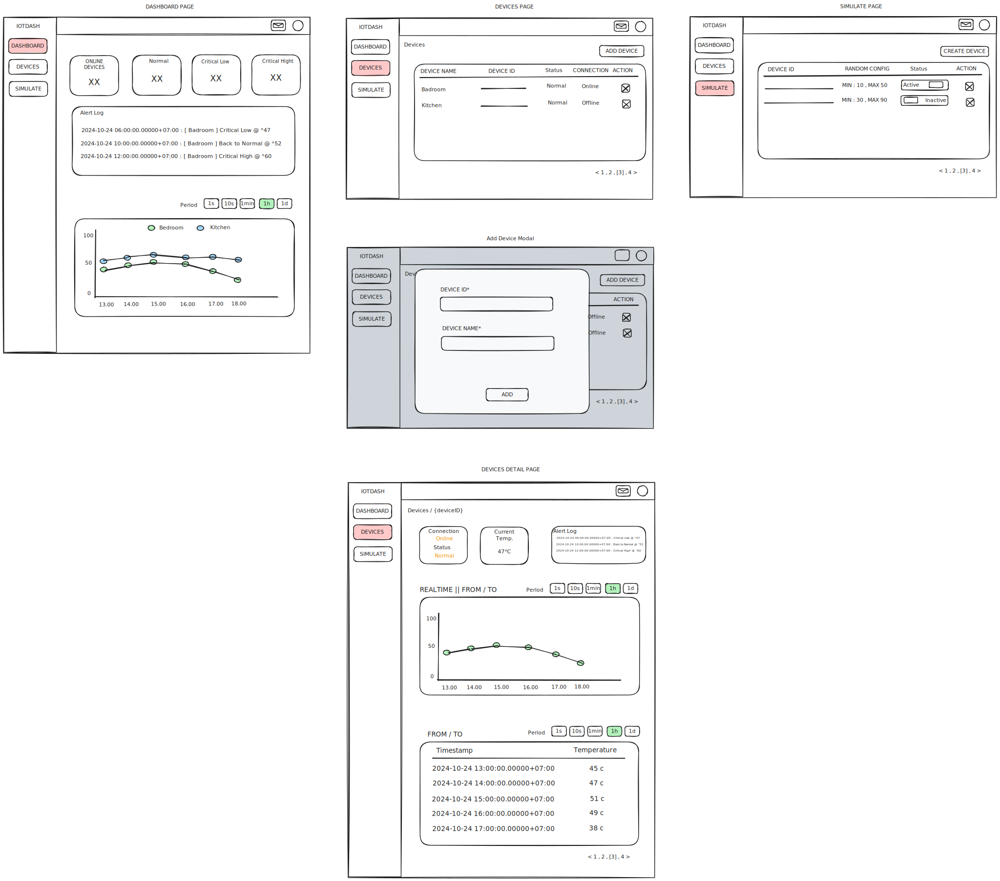

# PILOT PROJECT

:: Authentication ::

1. As a user, I want to register an account to access the dashboard.
2. As a user, I want to log in securely to access my personal dashboard.
3. As a user, I want to log out of the application to ensure my data is safe when I'm not using it.

:: Dashboard Overview ::

4. As a logged-in user, I want to view a list of all connected temperature measurement devices on the main dashboard.
5. As a user, I want to quickly see the current status (online/offline) of each device.
6. As a user, I want to name or label my devices for easy identification.

:: Device Details ::

7. As a user, when I select a specific device, I want to view detailed information and real-time temperature data.
8. As a user, I want to view historical temperature data for each device over different periods (e.g., past 24 hours, week, month).
9. As a user, I want to see the current temperature, average temperature, and maximum/minimum temperature for the selected period.
10. As a user, I want to view temperature data in a graphical format (line graph).

:: Alerts and Notifications ::

11. As a user, I want to set custom temperature limits for each device to receive alerts.
12. As a user, I want to receive real-time notifications with a system message box when the temperature exceeds the limits I set.
13. As a user, I want to view all temperature alert logs for each device with a system message box, dashboard page, notification page, and device page.

:: Device Management ::

16. As a user, I want to add a new temperature measurement device to my dashboard by entering their unique code.
17. As a user, I want to remove devices from the dashboard that I no longer wish to monitor.
18. As a user, I want to group my devices (e.g., by location or purpose) for better organization.

:: User Preferences ::

19. As a user, I want to set my preferred temperature unit (Celsius or Fahrenheit) for display across the dashboard.

:: Mobile Responsiveness ::

21. As a user, I want to access and interact with the dashboard smoothly on my mobile device.

:: Performance and Reliability ::

22. As a user, I expect the dashboard to update in real-time without manual refresh.
23. As a user, I want the application to handle temporary device disconnections smoothly by displaying the latest data and connection status.

:: Simulation ::

24. As a user, I want to create a simulation of temperature measurement devices to test the application's functionality, with the ability to generate mock device data such as device number and automatically generated random temperature.

---

## FRONTEND

STACK : NEXTJS, TAILWIND

- NEXTJS :: ทำ DASHBOARD FOR IOT
- TAILWIND ::
- CHART ::
  - :: TIME SERIE ::
    - BAR CHART
    - LINE CHART
- JWT FOR AUTH

## BACKEND

STACK : GOLANG

- GOLANG :: Ex. API Sensor ( MOCK OR RANDOM )

- JWT ?
  | HEADER PAYLOAD SIGNATURE
  | {HASH BASE64}.{HASH BASE64}.{HASH BASE64}

  SYNMETRIC :: PASSWORD ( SAME KEY )
  ASYMMETRIC :: PUBLIC KEY / PRIVATE KEY ( DIFFERENT KEY )
